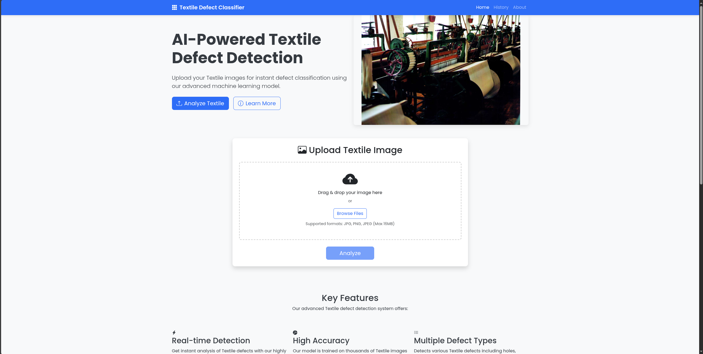
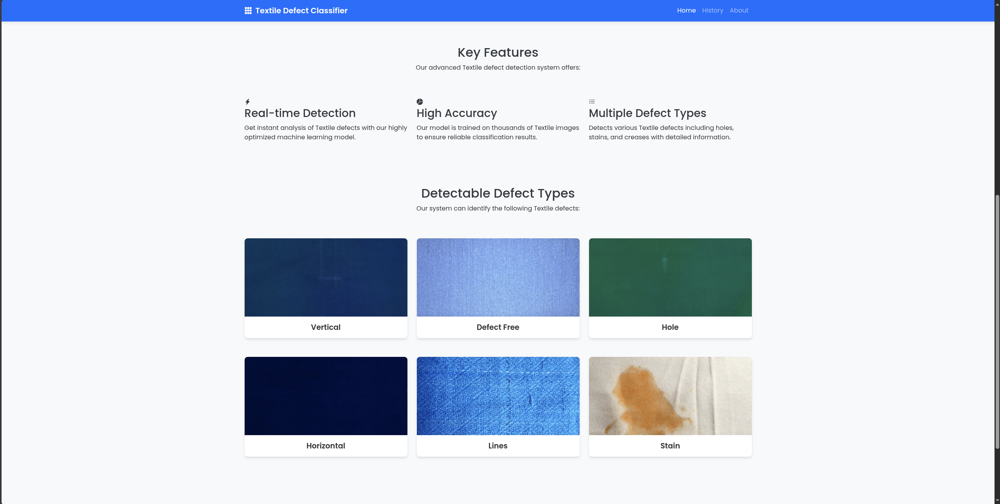
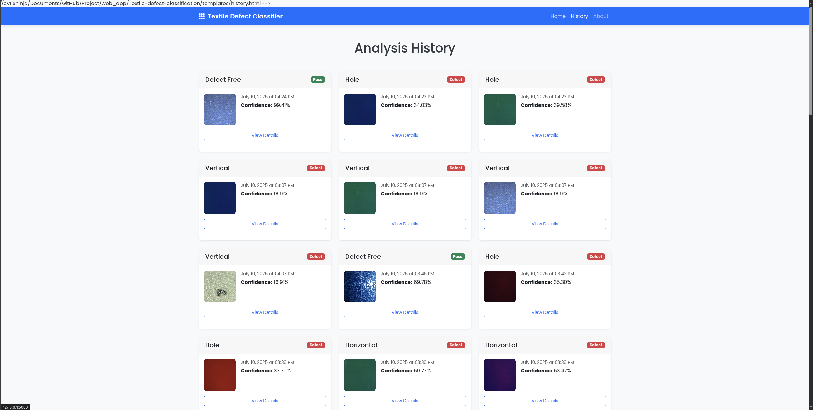
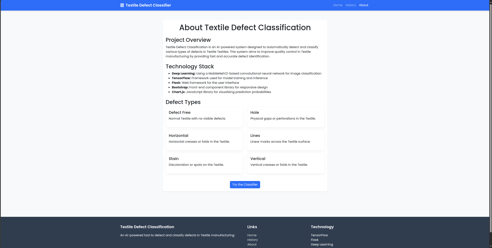
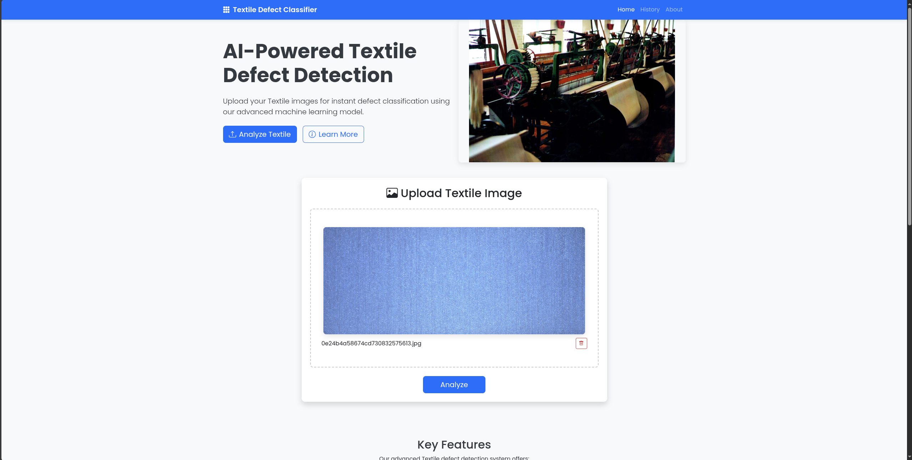
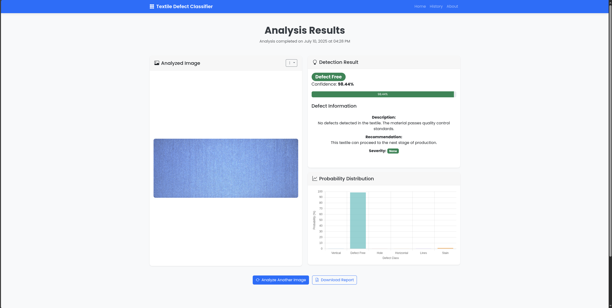

# Fabric Defect Classification System

## Overview
This project implements an AI-powered fabric defect classification system that can automatically detect and classify various types of defects in Fabric materials. The system uses deep learning to identify defects such as holes, stains, horizontal and vertical defects, and lines in fabric images.

## Dataset
The project uses the Fabric Defect Classification dataset available at:
https://data.mendeley.com/datasets/663j22s43c/3

The dataset contains images of 6 different classes:
- Defect free
- Hole
- Horizontal defect
- Vertical defect
- Lines
- Stain

## Model Development
The `model.ipynb` notebook contains the following:
1. Dataset exploration and visualization
2. Image preprocessing and data augmentation
3. Model architecture using MobileNetV2 transfer learning
4. Model training and evaluation
5. Result visualization and analysis

### Model Architecture
- Base model: MobileNetV2 (pre-trained on ImageNet)
- Additional layers: Global Average Pooling, Dense layers, Dropout
- Training method: Transfer learning
- Loss function: Categorical cross-entropy
- Optimizer: Adam

## Web Application
The Flask web application provides a user-friendly interface for uploading fabric images and getting defect predictions.

### Features
- Image upload functionality
- Real-time defect classification
- Visualization of prediction confidence
- Classification history tracking
- Defect information and recommendations

## Setup Instructions

### Model Training
1. Download the dataset from the provided link
2. Place the dataset in a directory named `dataset`
3. Run the `model.ipynb` notebook to train the model

### Web Application
1. Navigate to the web_app directory
```bash
cd web_app
```
2. Install the required dependencies
```bash
pip install -r requirements.txt
```
3. Make sure the trained model is in the models directory
4. Start the Flask application
```bash
python app.py
```
5.Open your web browser and go to http://127.0.0.1:5000/

### Usage
1.Upload an image of fabric through the web interface

2.Click the "Classify" button to submit the image

3.View the classification results, including defect type and confidence score

4.Check recommendations for addressing the identified defect

### Technology Stack
- Python: Primary programming language
- TensorFlow/Keras: Deep learning framework
- Flask: Web framework
- Bootstrap: Front-end design
- Chart.js: Data visualization
- PIL/OpenCV: Image processing

# Screenshots






